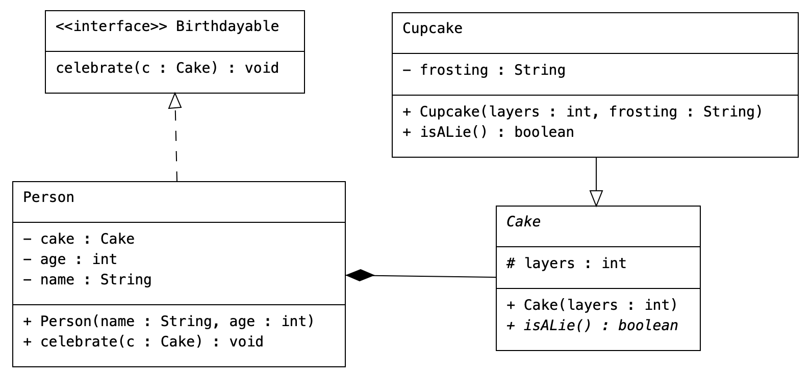

# Title

testing integration between github and gitbook.io....

now this is something that could lead somewhere

> well this is a quote

```
 @Override
    public void celebrate(Cake c) {
        age++;
        cake = c;
    }
```

more code...

```
public abstract class Cake {
    protected int layers;

    public Cake(int layers) { this.layers = layers; }

    public abstract boolean isALie();
}

public class Cupcake extends Cake {
    private String frosting;

    public Cupcake(int layers, String frosting) {
        super(layers);
        this.frosting = frosting;
    }

    @Override
    public boolean isALie() { return false; }
}

public interface Birthdayable {
    public void celebrate(Cake c);
}

public class Person implements Birthdayable {
    private String name;
    private int age;
    private Cake cake;

    public Person(String name, int age) {
        this.name = name;
        this.age = age;
        this.cake = null;
    }

    @Override
    public void celebrate(Cake c) {
        age++;
        cake = c;
    }
}
```

it is weidely known that as you type things tend to appear in the screen

looks like I can double-return which is good

this is essentially a variation of notion

is this better than notion?

good question


